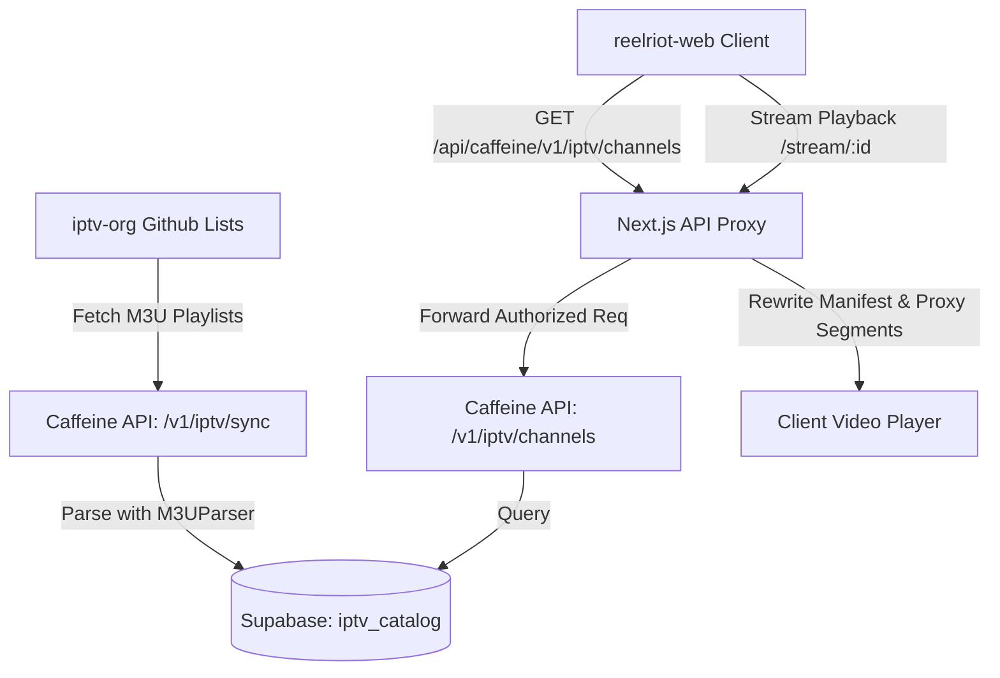

# Reelriot Ecosystem: IPTV Feature Report

This document provides a detailed overview of the **IPTV (Internet Protocol Television)** feature within the Reelriot ecosystem. It explains the system architecture, backend data ingestion, client-side rendering/proxying, and distinguishes it from the separate **Live Sports** feature.

---

## 🗺️ Architectural Overview

The IPTV feature is designed to host, query, and play 24/7 live television channels (such as local networks, news broadcasts, movie channels, and international feeds). 

The feature is controlled by the **`enable_iptv`** feature flag on the Caffeine API backend, which the client applications query during boot.

---

## ⚙️ Backend Processing (Caffeine API)

The backend handles IPTV channel synchronization and serves queries via Fastify routes located in [routes/iptv.ts](file:///c:/Users/cnieves.wmg/Desktop/Projects/caffeine-api/src/routes/iptv.ts).

### 1. Ingestion & Synchronization (`GET /v1/iptv/sync`)
This endpoint fetches playlists from the open-source `iptv-org` project. Currently, the following playlist streams are configured:
* **Countries:** United States, United Kingdom, Canada, Brazil (`.m3u` files).
* **Categories:** Movies, Sports, News (`.m3u` files).

The raw `.m3u` contents are parsed using [utils/M3UParser.ts](file:///c:/Users/cnieves.wmg/Desktop/Projects/caffeine-api/src/utils/M3UParser.ts), which extracts:
* Channel name (e.g., `BBC News`)
* Channel logo (`tvg-logo` attribute)
* Theme group/category (`group-title` attribute)
* HLS Stream URL (e.g., `http://.../index.m3u8`)

The parsed records are batched and upserted into the **`iptv_catalog`** table in Supabase. The sync operation enforces URL uniqueness to prevent duplicate channel entries.

### 2. Catalog Access (`GET /v1/iptv/channels`)
Serves the ingested channels to the frontend. It supports:
* Category filters (e.g., `Movies`, `News`)
* Text search (using case-insensitive `ilike` matching on the name)
* Limit constraints (defaults to `200` to prevent massive JSON payloads)

---

## 🖥️ Client Integration (Web Platform)

The web platform ([reelriot-web](file:///c:/Users/cnieves.wmg/Desktop/Projects/reelriot-web)) displays IPTV channels under a premium glassmorphic UI.

### 1. Hub UI & Grid Component
* On the TV client hub ([TVClient.tsx](file:///c:/Users/cnieves.wmg/Desktop/Projects/reelriot-web/src/app/tv/TVClient.tsx#L279)), the application fetches the channel list from the API proxy and renders them inside a horizontal scrolling row.
* Each channel is displayed using the [TVChannelCard.tsx](file:///c:/Users/cnieves.wmg/Desktop/Projects/reelriot-web/src/components/TVChannelCard.tsx) component. This card displays the channel logo, a category badge, and a glowing, pulsed red **"LIVE"** status dot.

### 2. Stream Proxying (Next.js CORS/Access Bypass)
Since external IPTV stream sources are hosted on thousands of different domains, streaming them directly in the browser will result in cross-origin resource sharing (CORS) blocks. 
* To resolve this, `reelriot-web` forwards HLS stream requests through its server-side routing proxy [api/caffeine/[...path]/route.ts](file:///c:/Users/cnieves.wmg/Desktop/Projects/reelriot-web/src/app/api/caffeine/%5B...path%5D/route.ts).
* The proxy intercepts the `.m3u8` manifest files and dynamically rewrites upstream segment/sub-playlist URLs to point back to the local `reelriot-web` proxy server.
* This ensures that binary segments (`.ts`, `.mp4`) are loaded through local proxies, preventing browser CORS exceptions and allowing ad-free playback.

---

## ⚽ IPTV vs. Live Sports: The Separation

It is critical to distinguish the **IPTV** feature from the **Live Sports** feature, as they utilize different architectures, databases, and client flows:

| Feature Dimension | IPTV Feature | Live Sports Feature |
| :--- | :--- | :--- |
| **Primary Intent** | 24/7 television network feeds (broadcasting general programming). | Event-based streams for active live games and leagues (NFL, NBA, soccer matches). |
| **Feature Flags** | `enable_iptv` | `enable_live_sports` |
| **Backend Engine** | Simple M3U synchronization from `iptv-org` feeds. | Multi-leagues scraping via a background Python daemon (`automate_sports.py` via Playwright & ESPN API). |
| **Database Table** | `iptv_catalog` | `live_streams` |
| **Source Resolvers** | Static streaming links defined in the M3U playlist. | Dynamic scraping resolvers from indexes (such as Streameast or DaddyLive). |

### Naming & Translation Overlaps in Client Codebases
There is some legacy naming overlap in the client codebases that developers should be aware of:
1. **Mobile Drawer Route:** 
   In the mobile app ([drawer_widget.dart](file:///c:/Users/cnieves.wmg/Desktop/Projects/reelriot/lib/widgets/drawer_widget.dart#L84)), there is a route labeled `live_tv`. This menu item opens `ChannelList` inside [live_tv_screen.dart](file:///c:/Users/cnieves.wmg/Desktop/Projects/reelriot/lib/screens/tv_screens/live_tv_screen.dart).
2. **Translation Key Mapping:**
   In English translation resources (`en.json`), `"live_tv"` maps to `"Live Sports (beta)"`. In Spanish (`es.json`), it maps to `"Deportes en vivo"`. 
3. **DaddyLive Sports Stream Integration:**
   In the mobile screens (`live_tv_screen.dart` and `sports_screen.dart`), the code contacts the backend route `/daddylive/live` (referenced internally as `getIPTVEndpoint`) to map dynamic sports schedules (ESPN) to active streams. This maps active matches to television channels on demand, but is treated as a sports stream resolver, not a general channel guide.
4. **Platform Availability:**
   While the mobile app utilizes DaddyLive HLS scraper feeds to back live sports events, **General IPTV 24/7 channels** (e.g. movies, news, entertainment guides) are currently exclusively served and displayed on the Web Platform (`reelriot-web`).
